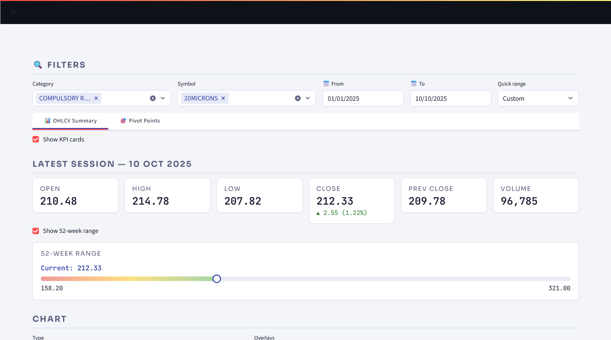
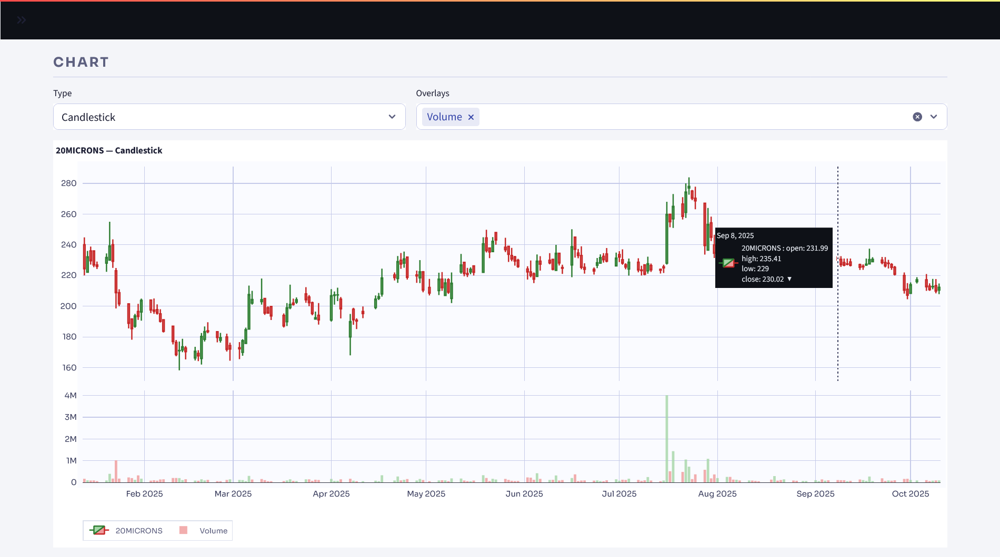
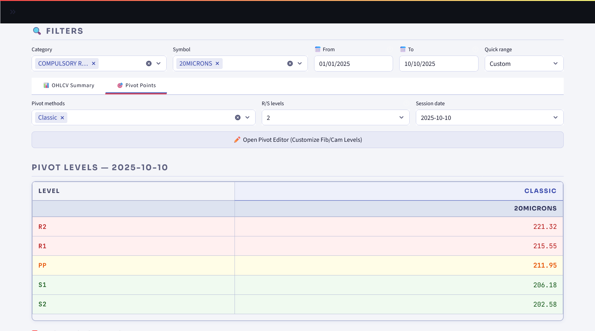
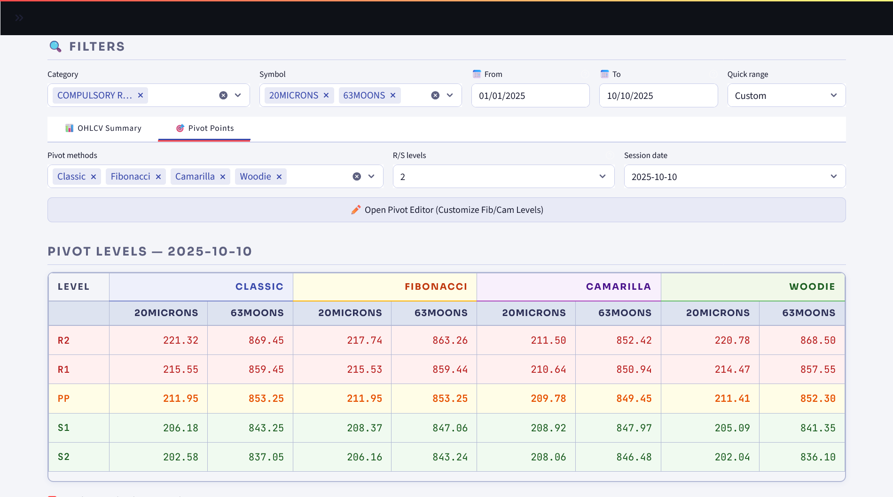
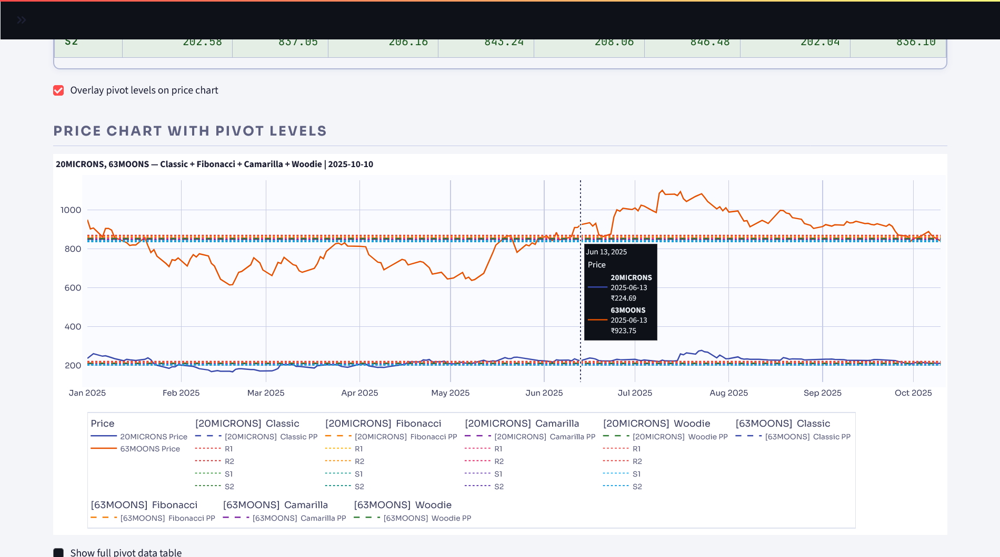
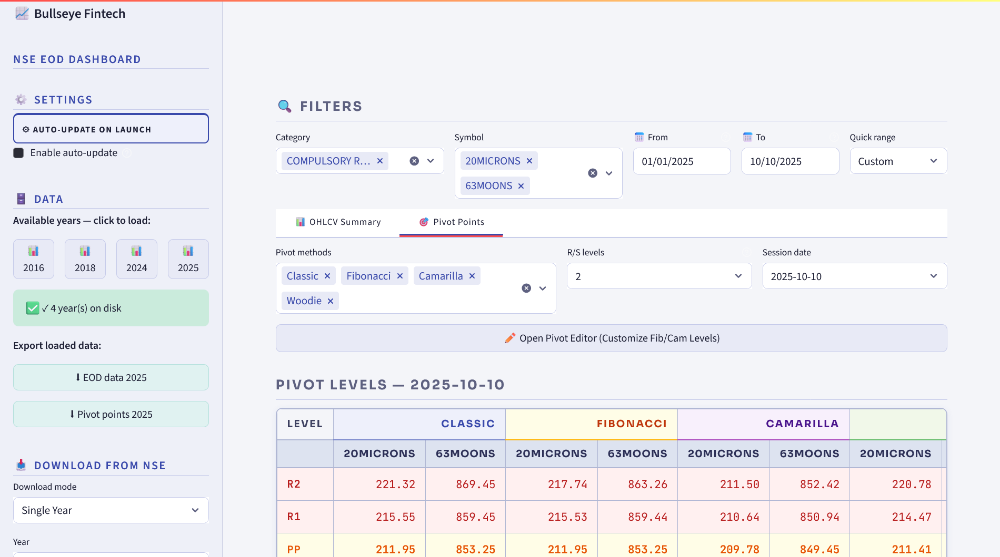
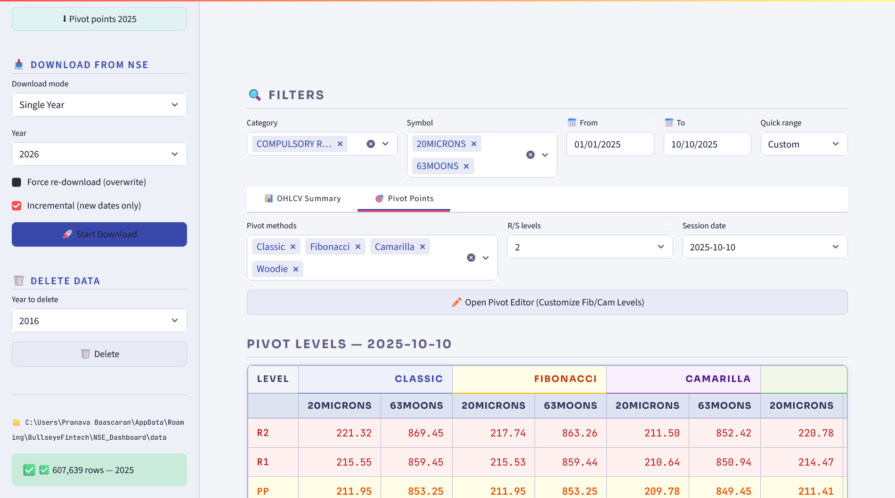

<div align="center">

<pre>
██████╗ ██╗   ██╗██╗     ██╗     ███████╗███████╗██╗   ██╗███████╗
██╔══██╗██║   ██║██║     ██║     ██╔════╝██╔════╝╚██╗ ██╔╝██╔════╝
██████╔╝██║   ██║██║     ██║     ███████╗█████╗   ╚████╔╝ █████╗  
██╔══██╗██║   ██║██║     ██║     ╚════██║██╔══╝    ╚██╔╝  ██╔══╝  
██████╔╝╚██████╔╝███████╗███████╗███████║███████╗   ██║   ███████╗
╚═════╝  ╚═════╝ ╚══════╝╚══════╝╚══════╝╚══════╝   ╚═╝   ╚══════╝
</pre>

**NSE End-of-Day Dashboard**

<br/>

[](https://python.org)
[](https://streamlit.io)
[](https://pola.rs)
[](https://nseindia.com)
[](LICENSE)

[](https://bullseye.readthedocs.io/en/latest/)

<br/>

*Download · Analyse · Pivot — all your NSE equity data, locally.*

</div>

<br/>

---

## Installation

<details>
<summary><strong>🖥️ Windows — Standalone Executable (recommended)</strong></summary>
<br/>

Download the latest `.exe` from the [**Releases**](../../releases/latest) page and double-click to run. No Python or dependencies required.

Data is stored in `%APPDATA%\BullseyeFintech\NSE_Dashboard\data\`

</details>

<details>
<summary><strong>🐍 Run from Source</strong></summary>
<br/>

Requires Python 3.10+.

```bash
git clone https://github.com/your-org/bullseye-nse-eod.git
cd bullseye-nse-eod
pip install streamlit polars pandas plotly requests pandas-market-calendars
streamlit run app_v2.py
```

The dashboard opens at `http://localhost:8501`.

</details>

---

## Quick Start

| Step | Action |
|------|--------|
| 1 | Open the **sidebar** (≡ top-left) |
| 2 | Under **Download from NSE**, pick a mode — Single Year, Multiple Years, or Date Range |
| 3 | Click **🚀 Start Download** and watch progress in real time |
| 4 | Click a year badge under **Available Years** to load it |
| 5 | Use the **Filters** bar to select a category, symbol, and date range |
| 6 | Switch between **OHLCV Summary** and **Pivot Points** tabs |

---

## Screenshots

<div align="center">

<table>
  <tr>
    <td></td>
    <td></td>
  </tr>
  <tr>
    <td></td>
    <td></td>
  </tr>
  <tr>
    <td></td>
    <td></td>
  </tr>
  <tr>
    <td colspan="2" align="center"></td>
  </tr>
</table>

</div>

---

## Features

<details>
<summary><strong>📥 Data Download</strong></summary>
<br/>

- Downloads NSE bhavcopy archives directly from `archives.nseindia.com`
- Four modes: Single Year, Multiple Years, Date Range, re-process all downloaded data
- Incremental mode — appends only new trading dates, skipping what's already saved
- Force re-download option to overwrite existing data
- Exponential backoff retry logic with automatic session re-priming on HTTP 403

</details>

<details>
<summary><strong>📊 OHLCV Analysis</strong></summary>
<br/>

- Chart types: Candlestick, OHLC Bar, Line
- Overlays: Volume (colour-coded), 20-Day MA, 50-Day MA, Bollinger Bands (±2σ)
- KPI cards with delta and % change, 52-week range bar
- Quick date presets: Last 30 days, 90 days, 6 months, YTD, Full year

</details>

<details>
<summary><strong>🎯 Pivot Points</strong></summary>
<br/>

Four methodologies computed daily for every symbol:

| Method | Pivot | Levels |
|--------|-------|--------|
| Classic | (H + L + C) / 3 | R1–R3, S1–S3 |
| Fibonacci | Classic ± 0.382 / 0.618 / 1.000 × Range | R1–R3, S1–S3 |
| Woodie | (H + L + 2C) / 4 | R1–R2, S1–S2 |
| Camarilla | Prev Close ± Range × 1.1 / (12, 6, 4, 2) | R1–R4, S1–S4 |

Displayed side-by-side in a colour-coded matrix. Levels are editable inline and can be overlaid directly on the price chart.

</details>

<details>
<summary><strong>💾 Export & Auto-Update</strong></summary>
<br/>

- Download EOD data or pivot table as CSV directly from the sidebar
- Optional auto-update fetches the previous trading day's data on launch
- Holiday-aware — consults the NSE trading calendar, skips non-trading days

</details>

---

## Data Notes

> All data is fetched from `https://archives.nseindia.com/archives/equities/bhavcopy/pr/`
> Historical data is available back to approximately 2000. All analysis features work fully offline once data is on disk.

---

<div align="center">

**Bullseye Fintech** · Chennai, India · © 2024–2026

</div>
